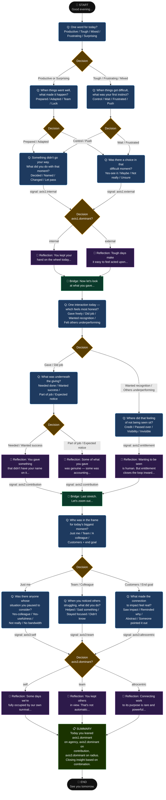

# Tree Diagram — Daily Reflection Tree

```mermaid
flowchart TD
    START([🌿 START\nGood evening...]) --> A1_OPEN

    A1_OPEN[Q: One word for today?\nProductive / Tough / Mixed /\nFrustrating / Surprising]
    A1_OPEN --> A1_D_OPEN{Decision}

    A1_D_OPEN -->|Productive or Surprising| A1_Q_WHAT_WORKED
    A1_D_OPEN -->|Tough / Frustrating / Mixed| A1_Q_HARD_MOMENT

    A1_Q_WHAT_WORKED[Q: When things went well,\nwhat made it happen?\nPrepared / Adapted / Team / Luck]
    A1_Q_HARD_MOMENT[Q: When things got difficult,\nwhat was your first instinct?\nControl / Wait / Frustrated / Push]

    A1_Q_WHAT_WORKED --> A1_D_WHAT_WORKED{Decision}
    A1_Q_HARD_MOMENT --> A1_D_HARD_MOMENT{Decision}

    A1_D_WHAT_WORKED -->|Prepared / Adapted| FOLLOW_INT
    A1_D_WHAT_WORKED -->|Team / Luck| FOLLOW_EXT
    A1_D_HARD_MOMENT -->|Control / Push| FOLLOW_INT
    A1_D_HARD_MOMENT -->|Wait / Frustrated| FOLLOW_EXT

    FOLLOW_INT[Q: Something didn't go your way.\nWhat did you do with that moment?\nDecided / Named / Changed / Let pass]
    FOLLOW_EXT[Q: Was there a choice in that\ndifficult moment?\nYes-see it / Maybe / Not really / Unsure]

    FOLLOW_INT -->|signal: axis1:internal| A1_D_AGENCY
    FOLLOW_EXT -->|signal: axis1:external| A1_D_AGENCY

    A1_D_AGENCY{Decision\naxis1.dominant?}
    A1_D_AGENCY -->|internal| A1_R_INTERNAL
    A1_D_AGENCY -->|external| A1_R_EXTERNAL

    A1_R_INTERNAL[💬 Reflection: You kept your\nhand on the wheel today...]
    A1_R_EXTERNAL[💬 Reflection: Tough days make\nit easy to feel acted upon...]

    A1_R_INTERNAL --> BRIDGE_1_2
    A1_R_EXTERNAL --> BRIDGE_1_2

    BRIDGE_1_2[🔗 Bridge: Now let's look\nat what you gave...]

    BRIDGE_1_2 --> A2_OPEN

    A2_OPEN[Q: One interaction today —\nwhich feels most honest?\nGave freely / Did job / Wanted recognition /\nFelt others underperforming]
    A2_OPEN --> A2_D_OPEN{Decision}

    A2_D_OPEN -->|Gave / Did job| A2_Q_CONTRIB_FOLLOW
    A2_D_OPEN -->|Wanted recognition / Others underperforming| A2_Q_ENTITLE_FOLLOW

    A2_Q_CONTRIB_FOLLOW[Q: What was underneath\nthe giving?\nNeeded done / Wanted success /\nPart of job / Expected notice]
    A2_Q_ENTITLE_FOLLOW[Q: Where did that feeling\nof not being seen sit?\nCredit / Passed over / Visibility / Invisible]

    A2_Q_CONTRIB_FOLLOW --> A2_D_CONTRIB{Decision}
    A2_D_CONTRIB -->|Needed / Wanted success| A2_R_CONTRIBUTION
    A2_D_CONTRIB -->|Part of job / Expected notice| A2_R_MIXED

    A2_Q_ENTITLE_FOLLOW -->|signal: axis2:entitlement| A2_R_ENTITLEMENT

    A2_R_CONTRIBUTION[💬 Reflection: You gave something\nthat didn't have your name on it...]
    A2_R_MIXED[💬 Reflection: Some of what you gave\nwas genuine — some was accounting...]
    A2_R_ENTITLEMENT[💬 Reflection: Wanting to be seen\nis human. But entitlement\ncloses the loop inward...]

    A2_R_CONTRIBUTION -->|signal: axis2:contribution| BRIDGE_2_3
    A2_R_MIXED -->|signal: axis2:contribution| BRIDGE_2_3
    A2_R_ENTITLEMENT --> BRIDGE_2_3

    BRIDGE_2_3[🔗 Bridge: Last stretch.\nLet's zoom out...]

    BRIDGE_2_3 --> A3_OPEN

    A3_OPEN[Q: Who was in the frame\nfor today's biggest moment?\nJust me / Team / A colleague /\nCustomers + end goal]
    A3_OPEN --> A3_D_OPEN{Decision}

    A3_D_OPEN -->|Just me| A3_Q_SELF_FOLLOW
    A3_D_OPEN -->|Team / Colleague| A3_Q_TEAM_FOLLOW
    A3_D_OPEN -->|Customers / End goal| A3_Q_WIDE_FOLLOW

    A3_Q_SELF_FOLLOW[Q: Was there anyone whose\nsituation you paused to consider?\nYes-colleague / Yes-usefulness /\nNot really / No bandwidth]
    A3_Q_TEAM_FOLLOW[Q: When you noticed others\nstruggling, what did you do?\nHelped / Said something /\nStayed focused / Didn't know]
    A3_Q_WIDE_FOLLOW[Q: What made the connection\nto impact feel real?\nSaw impact / Reminded why /\nAbstract / Someone pointed it out]

    A3_Q_SELF_FOLLOW -->|signal: axis3:self| A3_D_RADIUS
    A3_Q_TEAM_FOLLOW -->|signal: axis3:team| A3_D_RADIUS
    A3_Q_WIDE_FOLLOW -->|signal: axis3:altrocentric| A3_D_RADIUS

    A3_D_RADIUS{Decision\naxis3.dominant?}
    A3_D_RADIUS -->|self| A3_R_SELF
    A3_D_RADIUS -->|team| A3_R_TEAM
    A3_D_RADIUS -->|altrocentric| A3_R_WIDE

    A3_R_SELF[💬 Reflection: Some days we're\nfully occupied by our own survival...]
    A3_R_TEAM[💬 Reflection: You kept others\nin view. That's not automatic...]
    A3_R_WIDE[💬 Reflection: Connecting work\nto its purpose is rare and powerful...]

    A3_R_SELF --> SUMMARY
    A3_R_TEAM --> SUMMARY
    A3_R_WIDE --> SUMMARY

    SUMMARY[📋 SUMMARY\nToday you leaned axis1.dominant\non agency, axis2.dominant on\ncontribution, axis3.dominant on radius.\nClosing insight based on combination.]

    SUMMARY --> END([👋 END\nSee you tomorrow.])

    %% Styling
    classDef question fill:#1e3a5f,stroke:#4a9eda,color:#fff,rx:6
    classDef decision fill:#5a3e00,stroke:#f0a500,color:#fff
    classDef reflection fill:#2d1a4a,stroke:#9b59b6,color:#fff
    classDef bridge fill:#0a3a2a,stroke:#27ae60,color:#fff
    classDef summary fill:#1a3300,stroke:#5dbb63,color:#fff
    classDef terminal fill:#111,stroke:#888,color:#ccc,rx:20

    class A1_OPEN,A1_Q_WHAT_WORKED,A1_Q_HARD_MOMENT,FOLLOW_INT,FOLLOW_EXT,A2_OPEN,A2_Q_CONTRIB_FOLLOW,A2_Q_ENTITLE_FOLLOW,A3_OPEN,A3_Q_SELF_FOLLOW,A3_Q_TEAM_FOLLOW,A3_Q_WIDE_FOLLOW question
    class A1_D_OPEN,A1_D_WHAT_WORKED,A1_D_HARD_MOMENT,A1_D_AGENCY,A2_D_OPEN,A2_D_CONTRIB,A3_D_OPEN,A3_D_RADIUS decision
    class A1_R_INTERNAL,A1_R_EXTERNAL,A2_R_CONTRIBUTION,A2_R_MIXED,A2_R_ENTITLEMENT,A3_R_SELF,A3_R_TEAM,A3_R_WIDE reflection
    class BRIDGE_1_2,BRIDGE_2_3 bridge
    class SUMMARY summary
    class START,END terminal
```
